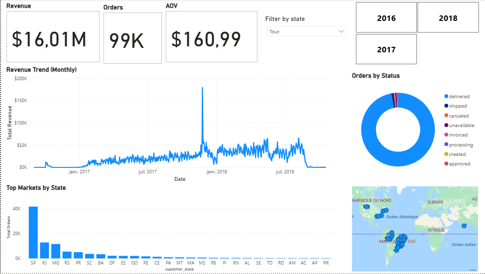

# 🇧🇷 Olist E-Commerce: Strategic Analytics Dashboard

> **A strategic Business Intelligence solution analyzing 100k+ orders from the Brazilian E-Commerce market (2016-2018).**

---

## 📊 Dashboard Preview
*An interactive view of the Executive Dashboard, featuring dynamic filtering by Year and State.*

)

### 📥 [Download the Dashboard Template (.pbit)](Olist_Analytics.pbit)
*To view the interactive dashboard, download this template file and open it in Power BI Desktop.*

---

## 🚀 Project Overview
This project represents the **Business Intelligence Layer** of my Olist E-Commerce solution. While my previous engineering project focused on the *pipeline*, this project focuses on the *value*.

It processes transactional data to answer key business questions:
* **Revenue Health:** Tracking the $16M sales performance over time.
* **Customer Segmentation:** Identifying "Champions" vs. "Churned" users (RFM).
* **Operational Efficiency:** Correlating delivery delays with review scores.

### 🔗 Relation to Data Engineering Project
This dashboard is built on top of the data pipeline I engineered previously.
* **Backend / ETL Pipeline:** [View the Python/SQL Source Code Here](https://github.com/ZinelabidineCh/brazilian-ecommerce-analysis)
* **This Repository:** Focuses strictly on Data Modeling (Star Schema), DAX Measures, and Visualization.

---

## 🏗️ Architecture & Workflow

1.  **Data Modeling (Star Schema):**
    * Designed a "Header/Detail" architecture in Power BI.
    * **Fact Table:** `Fact_Sales` (Centralized revenue metrics).
    * **Dimension Tables:** `Dim_Date` and `Dim_Customer` for high-performance filtering.
2.  **Visualization:**
    * **KPI Cards:** For immediate executive visibility ($16M Revenue, 99k Orders).
    * **Trend Analysis:** Corrected granularity mismatches to show accurate daily/monthly trends.
    * **Geospatial Analysis:** Mapped customer density to identify the "São Paulo" cluster.

---

## 🔧 "Errors Faced" & Architectural Decisions
During the interview and development process, I encountered specific challenges that required strategic pivots.

### 1. The "Database Locked" Concurrency Issue
* **The Challenge:** I originally architected a live ODBC connection between Power BI and SQLite to visualize RFM segments in real-time. However, SQLite's serverless locking mechanism caused errors when the Python ETL tried to write while Power BI was reading.
* **The Solution:** I implemented a **Decoupled Architecture**, pivoting to a CSV-based ingestion layer for the dashboard. This ensures high availability for the executive view while the Python pipeline processes heavy transformations in the background.

### 2. Date vs. DateTime Granularity
* **The Challenge:** The Revenue Trend chart initially showed a single dot instead of a line. This was due to a granularity mismatch: `Dim_Date` was at midnight (`00:00:00`), while `Fact_Sales` contained precise timestamps.
* **The Solution:** I used **Power Query** to transform the transaction column to `Date Only`, ensuring a valid One-to-Many relationship and accurate time-series trending.

### 3. SQL Logic: CTEs vs. Subqueries
* **The Decision:** In the business logic layer, I explicitly chose **Common Table Expressions (CTEs)** over Subqueries.
* **Why:** Calculating RFM (Recency, Frequency, Monetary) scores requires multi-step aggregation. Using CTEs allowed me to build the logic modularly (Clean -> Aggregate -> Score), significantly improving readability compared to nested subqueries.

---

## 📂 Repository Contents

| File | Description |
| :--- | :--- |
| `Olist_Analytics.pbit` | The Power BI Template file (Structure & Visuals). |
| `dashboard_static.png` | High-res preview of the dashboard. |
| `06_enterprise_rfm_analysis.sql` | The SQL logic used for customer segmentation. |

---

*Author: Zinelabidine Chiguer*
