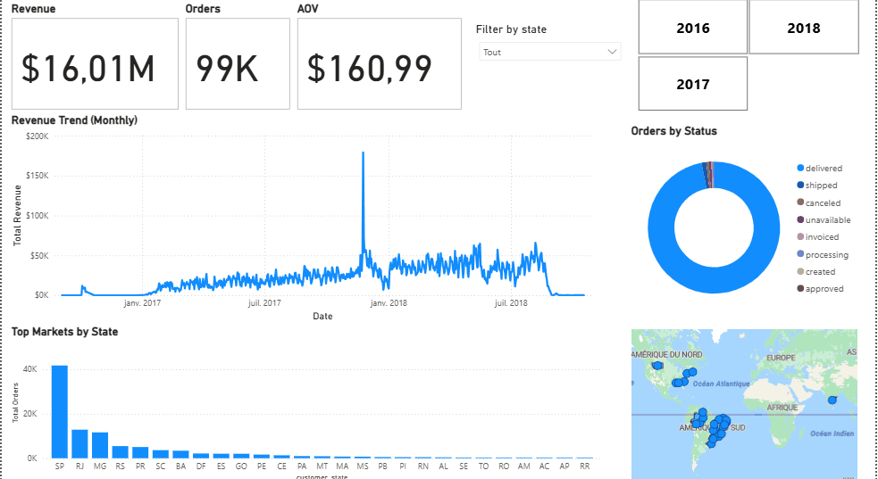

# Phase 2: Strategic Business Intelligence & Data Modeling (Power BI)

> **A strategic Business Intelligence solution transforming 100k+ Brazilian e-commerce records into executive-level insights.**

## 🎯 The Objective
This project represents the **Business Intelligence Layer** of my Olist trilogy. Building upon the local database engineered in [Phase 1: Python/SQL Foundation](https://github.com/ZinelabidineCh/olist-python-sql-foundation), I shifted focus from raw data exploration to **Enterprise Data Modeling** and **Strategic Reporting**.

---

## 📊 Dashboard Preview & Interactivity
*Experience the dynamic filtering and drill-down capabilities of the Olist Executive Suite.*

### 🕹️ Live Demo

*Note: The GIF demonstrates dynamic filtering by Year and State, showing real-time KPI updates and DAX measure recalculations.*

---

## 🏗️ Architecture & Data Modeling
To ensure high performance and analytical accuracy, I implemented a **Star Schema** architecture within Power BI:

* **Fact Table:** `Fact_Sales` (centralized revenue and order metrics).
* **Dimension Tables:** `Dim_Date`, `Dim_Customer`, and `Dim_Product` for high-speed filtering and attribute slicing.
* **DAX Logic:** Developed custom measures for **Year-over-Year (YoY) Growth**, **Average Order Value (AOV)**, and **Customer Lifetime Value (CLV)**.

---

## 🛠️ Challenges & Strategic Pivots (Troubleshooting)

### 1. The "Database Locked" Concurrency Issue
* **Problem:** Initial live ODBC connections to the SQLite database failed when the Python ETL script ran simultaneously (SQLite's file-locking mechanism).
* **Solution:** Pivoted to a **Decoupled Architecture**. By using a structured export layer (CSV/Parquet), I ensured the dashboard remains highly available for executives while the data pipeline runs independently in the background.

### 2. Time-Series Granularity Mismatch
* **Problem:** Revenue charts initially failed to trend correctly because `Dim_Date` was at the day level while `Fact_Sales` used precise timestamps (seconds).
* **Solution:** Used **Power Query (M)** to normalize transaction timestamps into `Date` formats, enabling a perfect One-to-Many relationship for accurate daily/monthly trending.

### 3. Modular SQL for RFM Segmentation
* **Decision:** I chose **Common Table Expressions (CTEs)** over nested subqueries to calculate Recency, Frequency, and Monetary (RFM) scores.
* **Why:** This made the complex multi-step aggregation readable and maintainable—a key requirement for enterprise-grade SQL.

---

## 📈 Visualizing Business Value
* **Executive KPI Cards:** Immediate visibility into $16M Total Revenue and 99k Orders.
* **Geospatial Insights:** Identified that the São Paulo hub accounts for the vast majority of sales, informing logistics and marketing priorities.
* **Logistics Health:** Correlated delivery delays with 1-star reviews to pinpoint operational bottlenecks (identifying that low scores are 2x more likely when delivery exceeds 20 days).

---

## 🚀 The Journey Continues
This project bridged the gap between raw code and business value. To see how I took this entire ecosystem to the **Cloud**, visit:
* **[Phase 3: Production Cloud ELT (GCP & Looker)](https://github.com/ZinelabidineCh/olist-elt-pipeline-gcp-looker)**

## 💻 Tech Stack
- **Tools:** Power BI Desktop, Power Query (M)
- **Logic:** DAX, SQL (CTEs, Joins, Window Functions)
- **Modeling:** Star Schema (Fact/Dimension)

---
*Author: Zinelabidine Chiguer*
